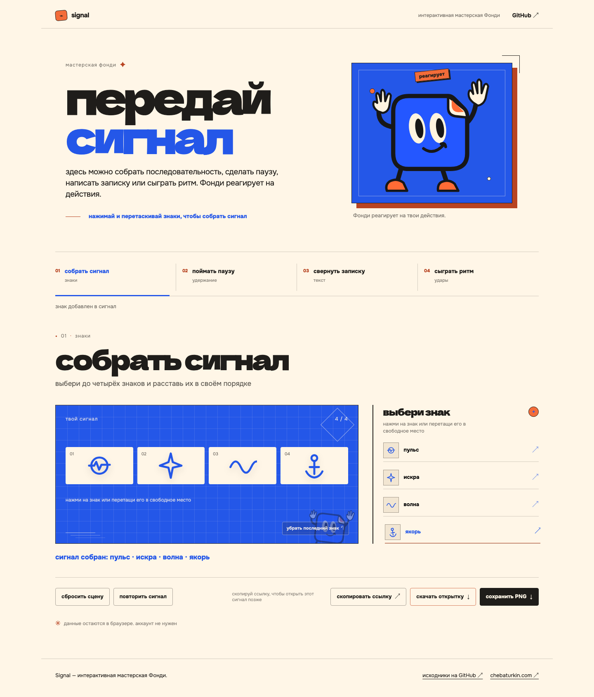
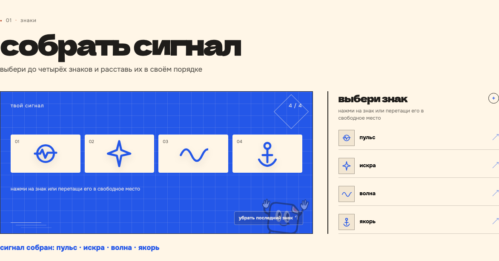
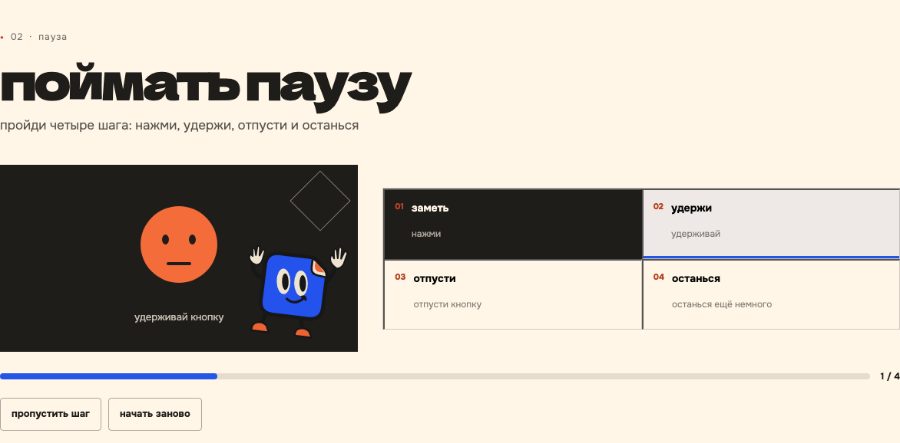
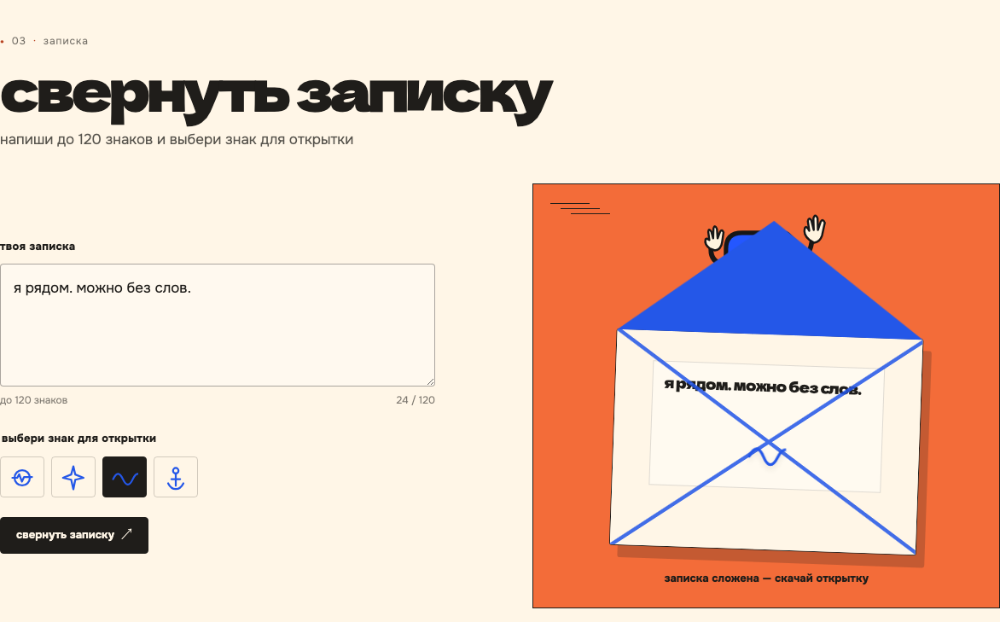
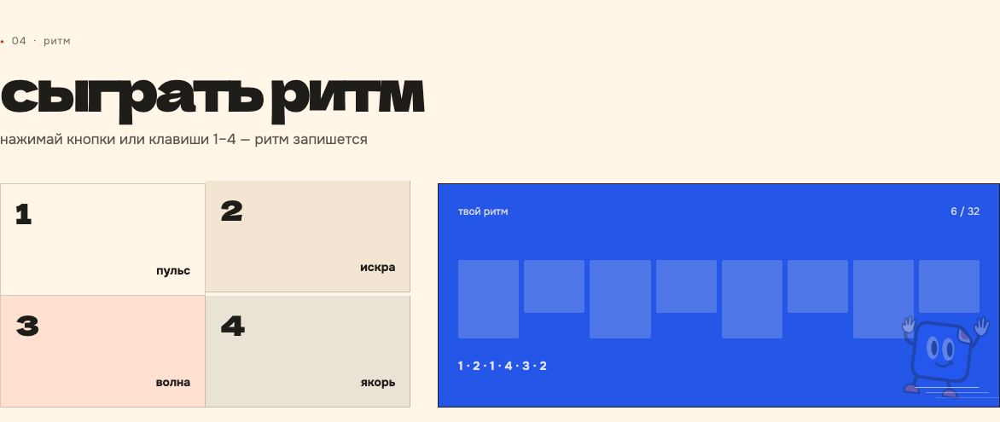
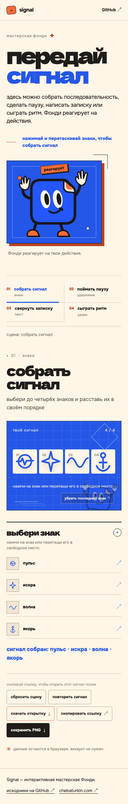

<div align="center">

# Signal · маленькая мастерская жестов

собрать сигнал, поймать паузу, свернуть записку или сыграть ритм — вместе с Фонди.

**[четыре сцены](#четыре-сцены)** · **[запустить локально](#запустить-локально)** · **[как-устроен-проект](#как-устроен-проект)**

</div>



Signal — визуальный pet-проект Тимофея Чебатуркина. здесь простое действие становится коротким жестом: последовательностью знаков, паузой, запиской или ритмом. Фонди реагирует на происходящее, а результат можно сохранить и передать дальше.

страница работает целиком в браузере. аккаунт не нужен; сервера, аналитики и внешнего API у проекта нет. шрифты и иллюстрации хранятся рядом с кодом.

## четыре сцены

<table>
<tr>
<td width="50%" valign="top">

### 01 · собрать сигнал

выберите до четырёх знаков и расставьте их в своём порядке. знаки можно добавлять нажатием или перетаскивать.



</td>
<td width="50%" valign="top">

### 02 · поймать паузу

пройдите четыре шага: заметьте, удержите, отпустите и останьтесь ещё немного. шаг можно пропустить или начать заново.



</td>
</tr>
<tr>
<td width="50%" valign="top">

### 03 · свернуть записку

напишите до 120 знаков, выберите знак и сверните записку в конверт.



</td>
<td width="50%" valign="top">

### 04 · сыграть ритм

нажимайте четыре клавиши или кнопки 1–4, чтобы записать последовательность до 32 ударов.



</td>
</tr>
</table>

## сохранить и передать

состояние мастерской хранится в URL-хэше — части адреса после `#`. скопируйте ссылку, чтобы вернуться к жесту или открыть его в другом браузере. текст записки тоже входит в ссылку: получатель сможет его прочитать.

текущий результат можно скачать как PNG или автономную HTML-открытку. данные не отправляются на сервер и не записываются в базу.

<details>
<summary><strong>мастерская на телефоне</strong></summary>
<br>


интерфейс подстраивается под узкий экран. сцены доступны с клавиатуры; для уменьшенного движения предусмотрен отдельный режим.

</details>

## запустить локально

нужен Python 3.11+. Node.js 20+ понадобится для проверок.

```bash
git clone https://github.com/chebaturkin/fondy-signal.git
cd fondy-signal
python3 site/build.py
python3 site/serve.py --port 8799
```

откройте [мастерскую в браузере](http://127.0.0.1:8799/). сборка работает без сети и создаёт статическую папку `site/public`, которую можно разместить на хостинге статических файлов. пути к ресурсам относительные: страница работает и из подпапки.

## как устроен проект

| путь | что здесь |
| --- | --- |
| [`site/sections`](site/sections) | разметка, оформление и действия четырёх сцен |
| [`site/lib/workshop-state.js`](site/lib/workshop-state.js) | проверка состояния и кодирование в URL-хэш |
| [`site/base.css`](site/base.css) | общие шрифты и визуальные настройки |
| [`site/build.py`](site/build.py) | сборка страницы и локальных ресурсов |
| [`site/serve.py`](site/serve.py) | сервер для локального просмотра |
| [`brand-kit/assets/mascot`](brand-kit/assets/mascot) | исходники Фонди |
| [`brand-kit/fonts`](brand-kit/fonts) | шрифты и их лицензии |

`site/assets`, `site/index.html` и `site/public` — результат сборки. меняйте исходники и запускайте `site/build.py`, чтобы обновить эти файлы.

подробнее: [мастерская](site/README.md) · [бренд-материалы](brand-kit/README.md).

## проверить изменения

```bash
python3 site/build.py
python3 -m pytest -q site/tests
node --test site/tests/test_workshop_state.mjs site/tests/test_workshop_contract.mjs
```

для браузерной проверки нужен Python-пакет Playwright и его Chromium. запустите локальный сервер, затем выполните `python3 site/verify.py`: проверка проходит по пяти размерам экрана, действиям сцен и экспорту результата.

## авторство и лицензии

код, персонаж, иллюстрации и тексты Signal принадлежат Тимофею Чебатуркину. отдельная лицензия на переиспользование пока не выбрана. для использования материалов в другом проекте нужно разрешение автора.

Dela Gothic One и Onest распространяются по SIL Open Font License; копии лицензий находятся в [`brand-kit/fonts`](brand-kit/fonts).

---

[Тимофей Чебатуркин](https://chebaturkin.com) · Signal
