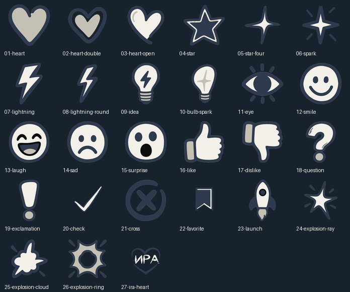

# Emoji Foundry

<p align="center">
  
</p>

> Приватная творческая мастерская для 27 цельных, рисованных от руки custom emoji для Telegram.

**Emoji Foundry** — исходник, сборочная система и готовый пакет авторских анимированных emoji. Все символы выполнены как бумажные объекты в единой четырёхцветной системе; основной формат доставки в Telegram — векторный TGS.

Репозиторий намеренно приватный. Это единственный актуальный источник пака, а не публичный генератор или библиотека ассетов.

## Что внутри

- 27 анимированных custom emoji в **TGS** — основном формате загрузки в Telegram.
- Резервные **WebM** с VP9 и прозрачностью.
- Статичные PNG 100 × 100 и редактируемые PNG 400 × 400.
- Python-система покадровой тактильной анимации.
- Валидаторы размеров Telegram, длительности, безопасной зоны, палитры, альфа-канала, структуры TGS и размера файлов.
- Актуальные review-boards 100 × 100 на светлом и тёмном фоне.

## Визуальная система

В видимых частях emoji разрешены только четыре цвета:

| Роль | Имя | Hex |
| --- | --- | --- |
| Основной силуэт, контур и глубина | BLUE | `#2E3A4D` |
| Тёплый вторичный материал | TAUPE | `#C4C1B4` |
| Бумага, блики и светлые буквы | PAPER | `#F2F0E9` |
| Редкая контрастная внутренняя деталь | INK | `#0D0D0D` |

Каждая анимация следует одной физической логике: предвосхищение → осмысленное действие → короткая реакция материала → естественное возвращение. Общая пульсация и fade, glitch, прямоугольные раскрытия и случайные фрагменты не входят в язык пака.

Актуальные визуальные решения зафиксированы в [CURRENT_STATE.md](05-ai-handoff/CURRENT_STATE.md) и [STYLE_SYSTEM.md](05-ai-handoff/STYLE_SYSTEM.md).

## Карта репозитория

```text
01-ready-to-upload/    Готовые TGS и WebM для Telegram
02-static-png/         Статичные PNG-экспорты
03-previews/           Review-boards и GIF-превью
04-editable-project/   Python-исходники, модули анимации, тесты и сборщики
05-ai-handoff/         Актуальные правила и машиночитаемый манифест пака
```

Канонические модули анимации находятся в `04-editable-project/frame_motions`. Файлы в release-папках, `frames`, `upload`, `tgs_upload` и `previews` генерируются автоматически.

## Быстрый старт

Требования:

- Python 3.10+
- Зависимости из `04-editable-project/requirements.txt`
- `04-editable-project/tools/ffmpeg` с поддержкой `libvpx-vp9`; встроенный файл рассчитан на macOS arm64.

```bash
cd 04-editable-project
python3 -m pip install -r requirements.txt

# Пересобрать и проверить один или несколько emoji.
python3 pack.py build --only 20-check,22-favorite

# Создать review-boards в реальном размере 100 × 100.
python3 pack.py review --only 20-check,22-favorite

# Пересобрать весь пак, пройти quality gate, собрать release во временную папку,
# синхронизировать release-папки и обновить SHA-256-контрольные суммы.
python3 pack.py release
```

## Проверка качества

Перед передачей или загрузкой в Telegram запусти:

```bash
cd 04-editable-project
python3 -m pytest -q
python3 validate_animated.py
python3 validate_tgs.py
```

Актуальные материалы для review лежат в `03-previews/review/current/`. Сначала оценивай вес линий и читаемость в 100 × 100; рендеры 400 × 400 нужны только как вспомогательный материал.

## Как изменить emoji

1. Прочитай [AGENTS.md](AGENTS.md), затем документы в `05-ai-handoff/`.
2. Найди целевой stem в `04-editable-project/pack_registry.py` и его модуль `frame_motions/mXX_name.py`.
3. Добавь узкий regression test и убедись, что он падает до изменения поведения анимации.
4. Запусти `python3 pack.py build --only <stem>` и `python3 pack.py review --only <stem>`.
5. Перед release пройди полный quality gate.

`20-check`, `22-favorite` и `27-ira-heart` рендерят release-статику из канонических векторных кадров. Остальные утверждённые статичные композиции явно используют master PNG; выбор зафиксирован в `pack_registry.py` и манифесте.

## Текущий статус

- 27/27 TGS-файлов
- 27/27 WebM-файлов
- 27/27 статичных PNG
- 232 автоматизированных теста
- SHA-256-манифест полного локального release-пакета

## Права и участие

Это приватный репозиторий. На код, визуальные ассеты, название и персональные знаки не выдаётся лицензия. Не распространяй, не используй повторно и не публикуй его содержимое без письменного разрешения владельца.

Правила будущей совместной работы находятся в [CONTRIBUTING.md](CONTRIBUTING.md). Порядок сообщений о проблемах безопасности описан в [SECURITY.md](SECURITY.md).
